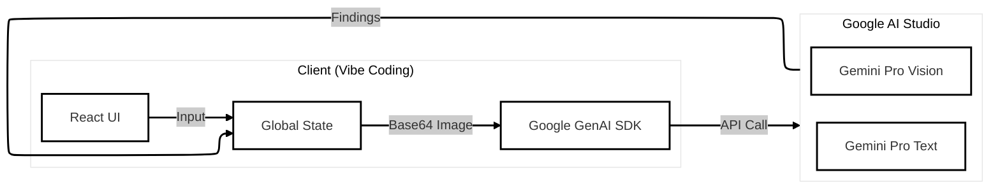
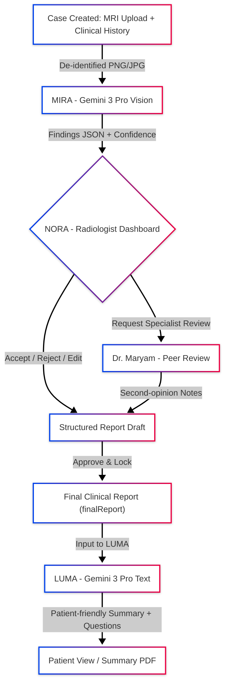

# EMMA: Endometriosis MRI Mapping Assistant  

**Diagnose Deeper. Understand Better.**

> 🔗 [**Demo Video:**](https://www.youtube.com/watch?v=iTnBj7eDLoY)  

---

## 📚 Table of Contents

[1. Problem](#problem)  
[2. Solution – EMMA in 60 seconds](#solution-60s)  
[3. Why Gemini 3 Pro?](#why-gemini)  
[4. Personas & User Journey](#personas-journey)  
[5. EMMA’s Agents](#emma-agents)  
[6. System Architecture](#system-architecture)  
[7. How to Run EMMA](#how-to-run)  
[8. Responsible AI Checklist](#responsible-ai)  
[9. Sample MRI Images (Radiopaedia)](#sample-mri)  
[10. Roadmap](#roadmap)  
[11. License](#license)  

---

## 🔍 1. Problem

Endometriosis is a global health crisis affecting an estimated [**1 in 10 women (≈190 million)**](https://www.who.int/news-room/fact-sheets/detail/endometriosis) worldwide, with a prevalence comparable to diabetes, it's a chronic condition where uterine-like tissue grows outside the uterus, often causing severe pain and impacting fertility, with up to 50% of infertile women having it. Yet the diagnostic journey is often long, confusing, and traumatic:

- **The “Lost Decade”**  
  The average delay from first symptoms to diagnosis is around [**7–10 years**](https://pmc.ncbi.nlm.nih.gov/articles/PMC12321876/) in many regions, with patients often seeing multiple clinicians before anyone names “endometriosis” (Source: [NIH / PMC](https://pmc.ncbi.nlm.nih.gov/articles/PMC12321876/)).

  

- **Specialist bottleneck in imaging**  
  Deep infiltrating endometriosis (DIE) is subtle and hard to detect on MRI. Accurate reads often require sub-specialist radiologists who are unevenly distributed globally (Source: [NIH / PMC](https://www.google.com/search?q=https://www.nature.com/articles/s41598-020-70493-2)).

- **Cognitive overload & burnout**  
  Pelvic MRI studies can contain **hundreds of slices** across multiple sequences (T1/T2, axial/sagittal, cine). Time-pressured radiologists may miss subtle patterns or struggle to standardize reports (Source: [NIH / PMC](https://pubmed.ncbi.nlm.nih.gov/36091649/)).

- **Patient confusion & anxiety**  
  Many patients receive dense, jargon-heavy radiology PDFs that are almost impossible to interpret. Anxiety and depression rates are very high in endometriosis, partly driven by uncertainty and lack of understandable information (Source: [NIH / PMC](https://pubmed.ncbi.nlm.nih.gov/39725706/)).

> **Core insight:**  
> We don’t just need *another classifier.* We need an end-to-end workflow that helps radiologists triage slices, collaborate with peers, and then *explain* the findings to patients in plain language.

<a href="#toc">⬆️ Back to top</a>

---
## 💡 2. Solution - EMMA in 60 seconds

**EMMA (Endometriosis MRI Mapping Assistant)** is a **multi-agent assistant** built entirely in **Google AI Studio (Vibe Coding)** on top of **Gemini 3 Pro**. It helps radiologists spot subtle endometriosis-related patterns in MRI studies and helps patients understand this chronic condition and prepare for their next steps in care.

EMMA does **three things well**:

1. **Helps radiologists triage MRI slices**  
   - **MIRA** (MRI Review Assistant) uses Gemini 3 Pro Vision to highlight candidate regions of interest and generate structured findings.
2. **Guides verification & peer reviews**  
   - **NORA** (Navigation & Orchestration Agent) turns those suggestions into an editable structured report and supports a “second opinion” Peer Reviewer mode.
3. **Explains the final, human-approved report to patients**  
   - **LUMA** (Lay Understanding & Medical Access Agent) converts the approved report into friendly explanations and “questions to ask your doctor.”

> EMMA **never** bypasses the radiologist.  
> The flow is: **AI → Radiologist → (Optional Peer) → Radiologist → Patient.**

<a href="#toc">⬆️ Back to top</a>

---
## 🌌 3. Why Gemini 3 Pro?

We chose **Gemini 3 Pro** because it is:

- **Multimodal** – one model can handle MRI slice images **and** clinical text.
- **Reasoning-capable** – supports multi-step workflows (MIRA → NORA → LUMA) with long-context understanding.
- **AI Studio native** – integrates cleanly into Google AI Studio / Vibe Coding, so UI and model calls live in one place.
- **Safety-aware** – lets us keep the model in a controlled environment while we iterate on a sensitive medical use case.

<a href="#toc">⬆️ Back to top</a>

---
## 👥 4. Personas & User Journey

We designed EMMA around three real-world personas:

1. **Dr. Smith – General Radiologist**  
   - Needs: Fast triage, structured reports, confidence when reading complex endometriosis cases.

2. **Dr. Maryam – Endometriosis Specialist & Peer Reviewer**  
   - Needs: A rich, case-at-a-glance view of complex MRIs and a streamlined way to add focused, specialist second opinions that guide final decisions.

3. **Jane Doe – Patient**  
   - Needs: “What does this actually mean?” in clear language, with visuals she can discuss with her doctor.

> 🧪 **Hackathon-friendly Persona Switcher**  
> For the sake of the hackathon and easy reproducibility, EMMA includes an in-app **persona switcher** that lets you instantly jump between Dr. Smith, Dr. Maryam, and Jane Doe views while keeping the **same in-progress case** intact.  
> This makes it easy for judges and reviewers to experience the full workflow - radiologist triage, specialist review, and patient explanation - in a single seamless demo without re-uploading data each time.

**End-to-end journey**

1. **Dr. Smith (General Radiologist) uploads the case**  
   De-identified pelvic MRI slices (T1/T2, axial/sagittal) and a short clinical history (e.g. years of cyclic pain, failed fertility treatments) are loaded into EMMA, creating a single, organized case workspace.

2. **MIRA triages the MRI with Gemini 3 Pro Vision**  
   MIRA scans representative slices and returns a small, focused set of **candidate endometriosis-related findings** with confidence levels and one-line rationales, for example:  
   - *“Endometrioma on left ovary - High confidence”*  
   - *“Thickening along the uterosacral ligament - Medium confidence”*  

   Instead of forcing Dr. Smith to scroll through hundreds of images, EMMA surfaces **where to look first**.

3. **NORA becomes the radiologist’s command center (with specialist hand-off)**  
   Inside NORA, Dr. Smith reviews each AI suggestion, **Accepts / Rejects / Edits** findings, and shapes them into a structured report. When the case looks complex or atypical, Dr. Smith clicks **“Request Specialist Review”**. EMMA bundles the MRI slices, MIRA’s findings, and Dr. Smith’s draft impression, then notifies **Dr. Maryam (endometriosis imaging specialist)** with a secure review link. Dr. Maryam can add concise, targeted second-opinion comments directly on the same findings - no email chains, no context lost.

4. **Dr. Smith reconciles input and locks in the final impression**  
   Once Dr. Maryam’s notes arrive, NORA presents a **consolidated view**:  
   AI suggestions, Dr. Smith’s edits, and Dr. Maryam’s specialist comments. Dr. Smith reconciles any differences, finalizes the wording, and clicks **“Approve & Generate Patient View”** - EMMA saves this as the **single source of truth** for the case.

5. **LUMA turns the report into an action-ready story for Jane (the patient)**  
   LUMA takes the radiologist-approved impression and generates a **plain-language summary**, a visual glossary for key terms (like “endometrioma” or “adhesions”), and a short list of **“Questions to ask at your next appointment.”** Jane never sees raw AI output - she sees a validated, human-reviewed story of her scan that helps her **understand her chronic condition and prepare mentally and practically for the next steps** in her care.

### EMMA at a Glance

<a href="#toc">⬆️ Back to top</a>

---
## 🤖 5. EMMA’s Agents

### 🩺 MIRA - MRI Review Assistant (Vision Agent)

- **Input**
  - A set of pelvic MRI slices (PNG/JPG for this demo).
  - Brief clinical history (e.g., “cyclic pelvic pain, dysmenorrhea, infertility workup”).

- **What MIRA does (hackathon build)**
  - Uses a Gemini 3 Pro Vision-like workflow (mocked for demo) to propose **3 key findings**, e.g.:
    - *“Endometrioma on left ovary” (High confidence)*
    - *“Thickening of uterosacral ligament” (Medium)*
    - *“Adhesion in pouch of Douglas” (Low)*
  - Attaches **confidence labels** and a short “reasoning snippet” (why this region matters).
  - Writes results into shared state (`aiFindings`) for NORA to consume.

> In a production setting, this would expand to full multi-sequence analysis and slice clustering.  
> For the hackathon, we show a **vertical slice of the experience** end-to-end.

### 👩‍⚕️ NORA - Navigation & Orchestration Agent (Radiologist Dashboard)

NORA is the **control center UI** for radiologists.

- **Split screen**
  - **Left:** MRI slice viewer (from `mriSlices`).
  - **Right:**  
    - List of MIRA’s suggested findings with **Accept / Reject** buttons.  
    - Structured report editor.

- **Features**
  - **Human-in-the-loop curation**  
    Radiologist **must** accept or edit findings before they appear in the report.
  - **Structured reporting**  
    Accepted findings are appended to a draft report that the radiologist can freely edit.
  - **Peer Review Mode**  
    - Switch personas between:
      - `Primary Radiologist` and `Peer Reviewer`.
    - UI border shifts to blue in Peer mode.
    - Peer can add **“Second Opinion Notes”**, e.g.:  
      *“Agree with ovarian endometrioma; consider lower suspicion on pouch of Douglas adhesion.”*

- **Approve & Generate Patient View**
  - Consolidates the findings into `finalReport`.
  - Optionally appends a short note that peer review was obtained.
  - Navigates to LUMA (Patient Explainer).

### 🧘‍♀️ LUMA - Lay Understanding & Medical Access Agent (Patient Explainer)

LUMA is **strictly downstream** of `finalReport`.

- **Guardrail:** LUMA only reads the **radiologist-approved** report. It cannot see raw AI drafts.
- **Translation**
  - Highlights medical terms and maps them to plain-language explanations, e.g.:

    - **Endometrioma** →  
      “A fluid-filled ovarian cyst often called a ‘chocolate cyst’ related to endometriosis.”

    - **Adhesion** →  
      “Bands of scar-like tissue that can cause organs to stick together.”

- **Presentation**
  - Friendly “Radiology Summary” header, e.g.:  
    > “This summary is based on a report reviewed and approved by your radiologist.”
  - Cards for each translated term.
  - A small section: **“Questions you may want to ask your doctor”**.
  - A safety badge footer:  
    > “Generated by EMMA (Endometriosis MRI Mapping Assistant), verified by human review. This is for understanding only and does not replace medical advice.”

<a href="#toc">⬆️ Back to top</a>

---
## 🏗️ 6. System Architecture
### Architecture Diagram

### High-level Flow

### Implementation Stack (Hackathon Build)

- **Platform:** Google AI Studio (Build / Vibe Coding)
- **Frontend:** React + Tailwind CSS (generated via Vibe Coding)
- **State:** React context / top-level state  
  (`currentCase`, `mriSlices`, `aiFindings`, `finalReport`, `mode`)
- **Model:** Gemini 3 Pro (vision + text) via AI Studio SDK  
  (responses are mocked in this prototype for deterministic demo)

<a href="#toc">⬆️ Back to top</a>

---
## 🧪 7. How to Run EMMA

> **Note:** EMMA is a **prototype** for the Kaggle “Google DeepMind – Vibe Code with Gemini 3 Pro in AI Studio” hackathon. Not for any clinical use yet.

### Prerequisites

- A **Google AI Studio** account  
- A **Gemini API key** from [Google AI Studio](https://aistudio.google.com)  
- Access to the public EMMA app link (Vibe-coded project)

### 1. Open EMMA in AI Studio

- Navigate to:  
  **🔗 [EMMA Vibe Coding App Link](https://emma-endometriosis-mri-mapping-assistant-524716835804.us-west1.run.app)**

### 2. Configure your API key

1. Click the **Settings / Gear** icon in the AI Studio app.
2. Paste your Gemini API key.
3. EMMA stores this **locally in your browser** (not on our servers).

### 3. Try the three roles

It is recommended to start with the **sample pelvic MRI images** included in this project (`demo-mri/` folder).  
If you accidentally upload a **non–pelvic MRI image** (e.g., a chest X-ray or a random JPG), EMMA’s safety layer kicks in:

- Gemini 3 Pro **recognizes and describes** the content,
- Detects that it is **not a valid pelvic MRI for endometriosis**, and  
- **Blocks the workflow** from moving forward, asking you to upload the correct imaging instead.

This means you’re not just seeing a demo - you’re seeing an early glimpse of **input validation guardrails** that would be critical in a real clinical setting.

Use the provided profile options to simulate each persona:

- **“Dr. Smith – Radiologist”**
  - Upload sample MRI slices from the `demo-mri/` folder.
  - Add a short clinical history.
  - Click **“Analyze with MIRA.”**
  - Observe mock Gemini findings and confidence labels.

- **“Dr. Chen – Peer Reviewer”**
  - Switch to the **Radiologist Dashboard (NORA)**.
  - Toggle to **Peer Reviewer** mode.
  - Add a short second-opinion note.

- **“Jane Doe – Patient”**
  - After clicking **“Approve & Generate Patient View”**, open **Patient Explainer (LUMA)**.
  - See the plain-language summary and question prompts.

<a href="#toc">⬆️ Back to top</a>

---
## ✅ 8. Responsible AI Checklist

- [x] **Radiologist approval required** before any patient-facing output  
- [x] **Specialist hand-off flow** for ambiguous/complex cases (request-based review by an endometriosis expert)  
- [x] **Educational-only patient summaries** with clear “not medical advice” disclaimer  
- [x] **De-identified, demo-only imaging data** used in this prototype (e.g., sample cases from Radiopaedia)  
- [x] **No treatment recommendations** generated by the model — EMMA focuses on triage, reporting, and explanation  
- [x] **Input validation guardrails**: non–pelvic MRI images are detected and blocked from entering the workflow  
- [x] **Strict role separation**: patients never see raw AI drafts; only radiologist-approved content flows into LUMA

<a href="#toc">⬆️ Back to top</a>

---
## 🩻🔍 9. Sample MRI Images (Radiopaedia)

For this prototype, sample pelvic MRI images were sourced from the **publicly available endometrioma cases** on Radiopaedia.org, specifically the reference article and linked cases for endometrioma.

These images were invaluable for two reasons:

- They provided **realistic pelvic MRI appearances** of endometriomas and related findings (e.g., T1 hyperintensity, T2 shading, “chocolate cyst” descriptions).
- Some of the radiology descriptors on Radiopaedia **qualitatively matched** the kinds of findings Gemini 3 Pro surfaced in early experiments, which helped us design more realistic mock outputs for MIRA (e.g., “endometrioma on left ovary”, “thickening along the uterosacral ligament”).

Reference:  
- [Endometrioma – Radiopaedia.org](https://radiopaedia.org/articles/endometrioma?lang=us)

All sample images used in this hackathon project are drawn from **public, educational resources** and are used here solely for demonstration and prototyping.

<a href="#toc">⬆️ Back to top</a>

---
## 🚀 10. Roadmap

EMMA is currently a focused prototype that showcases how Gemini 3 Pro can support radiologists and patients around endometriosis MRI. The long-term vision is to turn EMMA into a continuously learning, patient-centered ecosystem — one that not only helps read scans today, but also gets smarter and more supportive with every case, every outcome, and every story shared.

- **Feedback Loop: Learning from Missed Cases**  
  Create a secure feedback workflow where, with patient consent and specialist oversight, cases of *initially missed endometriosis* can be revisited:  
  - Endometriosis surgeons and specialist radiologists annotate where adhesions or lesions were ultimately found during surgery or multiple reviews.  
  - These “retrospective truth” annotations are used to continuously refine prompts, evaluation datasets, and eventually model behavior.  
  - Over time, EMMA becomes a system that *learns from the hardest cases*, helping future patients avoid the same delays.

- **Living Knowledge Base for Patients**  
  Add a curated, patient-friendly **knowledge hub** integrated into LUMA:  
  - Plain-language explainers on endometriosis types, symptoms, and common imaging findings.  
  - Links to vetted, up-to-date articles and guidelines from trusted sources (e.g., major hospitals, medical societies).  
  - A “What to read next” section tailored to the specific pattern in the patient’s report (e.g., deep infiltrating disease vs ovarian endometrioma).  
  - Optional “Find specialists near me” hooks that can surface lists of endometriosis-focused clinics or centers of excellence (via external directories).

- **Community & Social Support Network**  
  Explore a **moderated patient community layer** connected to EMMA, where people living with endometriosis can:  
  - Share their stories about the long diagnostic journey and what finally helped them get answers.  
  - Exchange practical tips on self-advocacy, symptom tracking, and preparing for specialist appointments.  
  - Discover existing advocacy groups, support organizations, and reputable online communities (rather than reinventing them).  

<a href="#toc">⬆️ Back to top</a>

---

## 📄 11. License

This project is released under the **MIT License**, a widely used and permissive open-source license that allows reuse, modification, and distribution with attribution.
